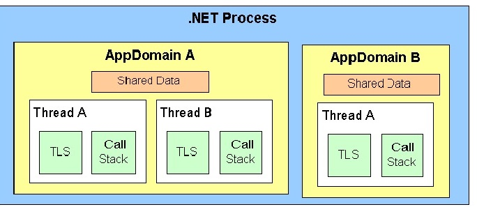

# .Net Domains Manipulation

#### Examples
* Execute Method In Seperate Domain   
  Flow:
    - Create Domain
    - Run method
    - Remove domain
    
* Load Assembly To Domain And Execute   
  Flow:
    - Load assembly Worker Joseph to seperate domain
    - Execute bootstrap method
    - Unload domain with assembly to free memory
    - Load assembly Worker Bob to seperate domain
    - Execute bootstrap method
    - Unload domain with assembly to free memory
    
#### Resources
* [.Net Framework App Domains](https://docs.microsoft.com/en-us/dotnet/framework/app-domains/use)
